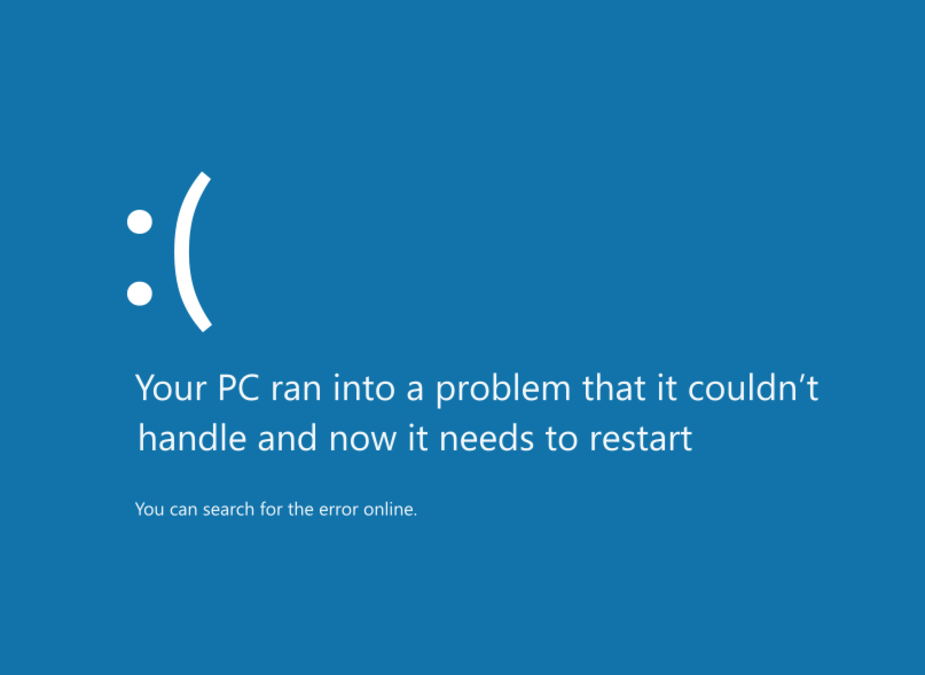

# Windows 8 Blue Screen of Death



```bash
./generate_slide.sh --profile minimal \
  --set BACKGROUND_IMG="https://raw.githubusercontent.com/badele/slide-generator-templates/refs/heads/main/windows8_BSOD/template.svg" \
  --set TEXT1="Your PC ran into a problem that it couldn’t" \
  --set TEXT2="handle and now it needs to restart" \
  --set TEXT3="You can search for the error online."
```
